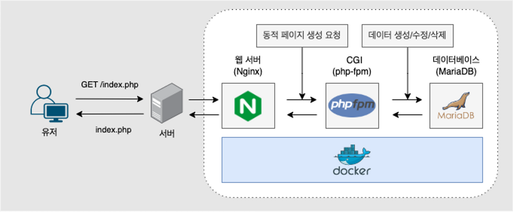

# Inception

*이 프로젝트는 Docker를 사용하여 시스템 관리 지식을 확장하는 것을 목표로 한다.*

# Summary

1. [Definitions](https://www.notion.so/For-evaluation-01734294531a4799bb83f016b18a34e0?pvs=21)
2. [Docker](https://www.notion.so/For-evaluation-01734294531a4799bb83f016b18a34e0?pvs=21)
3. [Nginx](https://www.notion.so/For-evaluation-01734294531a4799bb83f016b18a34e0?pvs=21)
4. [Wordpress](https://www.notion.so/For-evaluation-01734294531a4799bb83f016b18a34e0?pvs=21)
5. [Mariadb](https://www.notion.so/For-evaluation-01734294531a4799bb83f016b18a34e0?pvs=21)

# Definitions

### What is 3 Tier-Architecture?

- *애플리케이션을 프레젠테이션(Web Server) 계층, 애플리케이션(AP) 계층, 데이터(Data) 계층이라는 3개의 논리적이고 물리적인 컴퓨팅 계층으로 구성하는 확립된 소프트웨어 애플리케이션 아키텍쳐다.*
    
    
    

**3 Tier server**

- Web Server : 클라이언트가 보려고 하는 GUI, interface, webpage를 제공해주는 서비스.
- Application Server : page나 interface를 보는 것 외에 주문, 결제 검색 등 다양한 기능을 실질적으로 처리하는 계층.
- Database Server : 사용자의 요청을 처리할 때, 데이터에 대한 작업을 지원하고 보관하는 계층.

→ [3계층 아키텍처란?](https://www.notion.so/Computer-architecture-94a8835acbd644e0b77704dc51ba01d9?pvs=21) **[IBM]**

→ [3계층 구조](https://dbknowledge.tistory.com/78) **[TSTORY]**

# Docker

### What is docker?

*컨테이너 기반의 오픈소스 가상화 플랫폼이다.*

- 애플리케이션과 실행하는데 필요한 모든 종속성을 함께 포장하는 방식으로, 배포와 실행을 보다 단순화하고, 효율적으로 만드는 기술이다.
- **ENTRYPOINT VS CMD❓**
    
    `ENTRYPOINT`와 `CMD` 사이에 어떤 차이가 있는지 설명하기 전에, `dumb-init`에 대한 간단한 설명을 먼저 드리겠습니다. `dumb-init`은 Docker 컨테이너에서 사용하기 위해 설계된 간단한 프로세스 관리자로, 컨테이너 내에서의 신호처리 문제와 좀비 프로세스 문제를 해결해주는 역할을 합니다.
    
    이제 두 Dockerfile 구문의 차이에 대해 살펴보겠습니다:
    
    1. `ENTRYPOINT ["/usr/bin/dumb-init", "--", "nginx", "-g", "daemon off;"]`
        
        이 구문에서는 `ENTRYPOINT`만 사용되고 있습니다. 컨테이너가 시작될 때 실행되는 명령은 `/usr/bin/dumb-init -- nginx -g daemon off;`이며, 이 명령은 항상 실행됩니다. `CMD`가 없기 때문에, 사용자가 docker run 명령 시 전달하는 추가적인 인수들은 이 `ENTRYPOINT` 명령에 추가로 붙게 됩니다.
        
    2. `ENTRYPOINT [ "/usr/bin/dumb-init", "--" ]CMD [ "nginx", "-g", "daemon off;" ]`
        
        이 구문에서는 `ENTRYPOINT`와 `CMD`가 모두 사용되고 있습니다. `ENTRYPOINT`는 `/usr/bin/dumb-init --`이고, `CMD`는 `nginx -g daemon off;`입니다. 컨테이너가 시작될 때 실행되는 명령은 기본적으로 `ENTRYPOINT`와 `CMD`를 합친 `/usr/bin/dumb-init -- nginx -g daemon off;`이며, 이 명령은 항상 실행됩니다.
        
        하지만 사용자가 docker run 명령 시 전달하는 추가적인 인수들은 `CMD` 부분을 대체하게 됩니다. 예를 들어, 사용자가 `docker run <image> server`라는 명령을 실행하면, 실제로 실행되는 명령은 `/usr/bin/dumb-init -- server`가 됩니다. 따라서 `CMD`를 "기본값"으로 생각할 수 있으며, 필요에 따라 사용자가 변경할 수 있습니다.
        
    
    따라서, 이 두 방식의 차이점은 `CMD`를 사용하는 경우에는 docker run 명령에서 사용자가 전달하는 인수에 따라 실행되는 명령이 변경될 수 있다는 것입니다. 반면 `ENTRYPOINT`만 사용하는 경우에는 실행되는 명령이 항상 동일하며, 사용자가 전달하는 인수들은 `ENTRYPOINT` 명령에 추가로 붙게 됩니다.
    

### What is PID 1?

*PID1(Process Identifier 1)은 컨테이너에서 가장 먼저 시작된 프로세스를 가리킨다.*

- 컨테이너 환경에서 PID 1으로 동작하는 프로세스는 모든 종료된 자식 프로세스에 대한 정보를 수집하고, 시스템 신호를 적절하게 처리하는 등의 역할을 한다.

### What is Dumb Init with Daemon?

*Docker 컨테이너의 PID1으로 동작한다.*

- 일부 애플리케이션은 좀비 프로세스와 신호를 적절히 처리하지 못해서 기대하지 못한 동작을 할 수 있기에, dumb-init이 이 동작을 대신하여 작동한다.

# Nginx

### What is nginx?

*높은 동시성 연결을 처리하는 데 최적화된 오픈 소스 웹 서버 및 리버스 프록시 서버이다.*

# Wordpress

### What is wordpress?

*웹사이트 제작을 위한 오픈소스 컨텐츠 관리 시스템(CMS)이다.*

- 워드프레스는 PHP로 작성되었으며 MySQL 또는 MariaDB 데이터베이스를 사용한다.

### What is CGI(Common Gateway Inerface)?

*CGI는 웹 서버와 동적 콘텐츠 생성 프로그램(예를 들면, 스크립트) 사이의 표준 인터페이스이다.*

- 이 인터페이스를 통해 웹 서버는 클라이언트의 HTTP 요청을 처리하고 웹 페이지를 동적으로 생성할 수 있는 프로그램을 호출할 수 있다.

### What is php-fpm(FastCGI Process Manager for PHP)?

*PHP-FPM은 FastCGI를 구현한 것으로, PHP 애플리케이션을 실행하고 웹 서버와 통신하는 방식을 향상시킨다.*

- FastCGI는 CGI의 개념을 확장하여 요청을 처리하기 위해 프로세스를 재사용하는 방식을 도입했다.

# Mariadb

### What is mariadb?

*오픈 소스의 관계형 데이터베이스 관리 시스템(RDBMS)이다.*

### How database working?

```bash
mysql -uroot // To connect on mysql CLI
SELECT User FROM mysql.user; // To see all the users
USE wordpress // To connect on your wordpress database
mysqldump -u username -p databasename > filename.sql // To export the file
mysql -uroot -p$MYSQL_ROOT_PASSWORD $MYSQL_DATABASE < /usr/local/bin/wordpress.sql // To import the file

SHOW DATABASES; // show the databes
use 'wordpress'; // go in the wordpress databse
SHOW TABLES; // show all the tables from the database you selected
SELECT wp_users.display_name FROM wp_users; // display username from wordpress database
SELECT *  FROM wp_users; // select
```